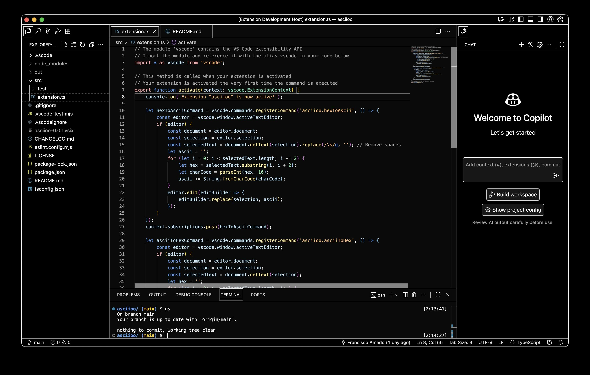

# Shaddy

A Visual Studio Code theme inspired by shadcn/ui colors, built on the foundation of the default Dark High Contrast theme.

## Description

Shaddy combines the accessibility and readability of VS Code's Dark High Contrast theme with the modern, elegant color palette from shadcn/ui. This theme provides an improved aesthetic on the Dark High Constrast theme while maintaining the contrast for better code readability.

## Features

- Built on VS Code's high contrast base for optimal accessibility
- Inspired by [shadcn/ui](https://ui.shadcn.com/colors)'s refined color scheme
- Enhanced syntax highlighting with carefully selected colors

Perfect for developers who need high contrast without sacrificing style!

## Installation

1. Open Visual Studio Code
2. Go to the Extensions view
3. Search for "Shaddy"
4. Click Install
5. Go to File > Preferences > Color Theme and select "Shaddy"

## Development

This theme is built as a VS Code extension with the theme definition in `themes/Shaddy-color-theme.json`.

## Future Work

- [ ] Light mode
- [ ] [Theme variants](https://ui.shadcn.com/themes) to come!
- [ ] Support for more language-specific syntax highlighting

**Enjoy coding with better style!**
